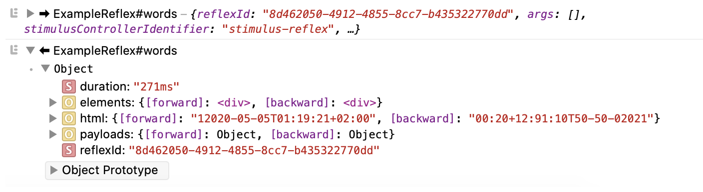

# Troubleshooting


## Logging

### Client-Side

You might want to know the order in which your Reflexes are called, how long it took to process each Reflex or what the Reflex response payload contains. Luckily you can enable Reflex logging to your browser's Console Inspector.



There are two ways to enable client debugging in your StimulusReflex instance.

You can provide `debug: true` to the initialize options like this:


```javascript
StimulusReflex.initialize(application, { consumer, debug: true })
```


You can also set debug mode after you've initialized StimulusReflex. This is especially useful if you just want to log the Reflex calls in your development environment:


```javascript
StimulusReflex.initialize(application, { consumer })
if (process.env.RAILS_ENV === 'development') StimulusReflex.debug = true
```


### Server-Side

To get debug logging for Sockpuppet you need to make some modifications to `LOGGING` in `settings.py`. Below you can see an example logging configuration that enables debug level logging Sockpuppet.

```python
LOGGING = {
    'version': 1,
    'disable_existing_loggers': False,
    'root': {
        'handlers': ['console'],
        'level': 'DEBUG'
    },
    'handlers': {
        'sockpuppet': {
            'level': 'DEBUG',
            'class': 'logging.StreamHandler',
            'formatter': 'simple'
        }
    },
    'formatters': {
        'simple': {
            'format': '%(levelname)s %(message)s'
        },
    },
    'loggers': {
        'sockpuppet': {
            'level': 'DEBUG',
            'handlers': ['sockpuppet']
        }
    }
}
```

